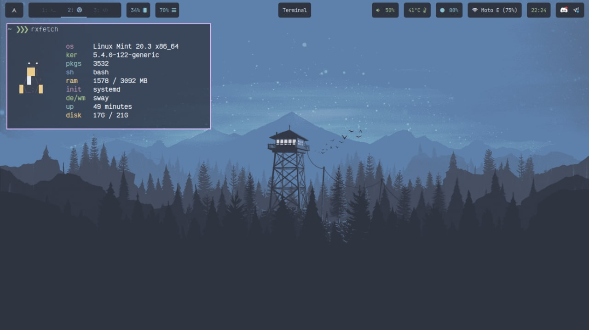

<h1 align="center">SWAY</h1>

 

<!-- BADGES -->

   

   
   
   

 

  

Sway is a tiling Wayland compositor and a drop-in replacement for the i3 window manager for X11. It works with your existing i3 configuration and supports most of i3's features, plus a few extras. 

- **Operating System** : `Linux Mint`
- **Window Manager** : `Sway`
- **Status Bar** : `Waybar`
- **Launcher** : `Wofi`
- **Session Manager** : `Wlogout`
- **Notifications** : `Dunst`
- **Terminal** : `xfce4-terminal`
- **File Manager** : `Thunar`
